# Credit Card Churn Model - Pipeline Diagrams

---

## 1. High-Level Architecture

```mermaid
graph TB
    subgraph External["External Systems"]
        ORA[(Oracle DB (Configured via ORACLE_DSN))]
    end

    subgraph Config["Configuration"]
        ENV["Environment Variables: ORACLE_USER, PASSWORD, DSN"]
        CFG["src/config.py: DB, SQL_PARAMS, OUTPUT_CSV, STAGING_DIR, WINSOR percentiles"]
    end

    subgraph Orchestration["Orchestration Layer"]
        PREFECT["Prefect 3 Flow: churn_etl_pipeline"]
        TASKS["Prefect Tasks: extract, validate, transform, save"]
        ARTIFACTS["Prefect Artifacts: Markdown validation reports"]
    end

    subgraph Core["Core Pipeline"]
        DBM["OracleConnectionManager - src/db_manager.py"]
        ETL["Feature Engineering - src/etl/pipeline/etl_steps.py"]
        VAL["DataValidator - src/etl/pipeline/validator.py"]
        SCH["Pandera Schemas - src/etl/pipeline/schemas.py"]
    end

    subgraph Outputs["Outputs"]
        STG["staging/run_id - parquet snapshots"]
        CSV["output - base_features.csv"]
        LOGS["logs - pipeline_*.log"]
    end

    ENV --> CFG
    CFG --> PREFECT
    PREFECT --> TASKS
    TASKS --> DBM
    DBM --> ORA
    TASKS --> ETL
    TASKS --> VAL
    VAL --> SCH
    VAL --> ARTIFACTS
    TASKS --> STG
    TASKS --> CSV
    PREFECT --> LOGS
```

---

## 2. End-to-End ETL Pipeline Flow (Prefect)

```mermaid
flowchart TD
    START([python run.py]) --> INIT["Setup file logger, Generate run_id"]

    INIT --> E1

    subgraph STEP1["Step 1 — Extract"]
        E1["extract_from_db - retries=3, delay=30s"]
        E1 --> V1["validate_step - RawExtractSchema"]
        V1 --> S1["save_staging_parquet - 01_raw_extract.parquet"]
    end

    S1 --> T2

    subgraph STEP2["Step 2 — Lagged Originals"]
        T2["task_create_lagged_originals - 20 lag columns added"]
        T2 --> V2["validate_step - LaggedOriginalsSchema"]
    end

    V2 --> T3

    subgraph STEP3["Step 3 — Engineered Base"]
        T3["task_create_engineered_base - 9+ engineered columns"]
        T3 --> V3["validate_step - EngineeredBaseSchema"]
    end

    V3 --> T4

    subgraph STEP4["Step 4 — Lagged and Derived Features"]
        T4["task_create_engineered_lagged_and_derived - lags, deltas, pct_chg, trends, volatility"]
        T4 --> V4["validate_step - FinalFeaturesSchema"]
    end

    V4 --> T5

    subgraph STEP5["Step 5 — Winsorisation"]
        T5["task_winsorise_features - clip at 1st/99th percentile"]
        T5 --> WA["create Winsorisation Prefect artifact"]
    end

    WA --> T6

    subgraph STEP6["Step 6 — Churn Targets"]
        T6["task_create_churn_targets - CHURN_1M, 2M, 3M"]
        T6 --> V6["validate_step - FeaturesTargetSchema"]
    end

    V6 --> SAVE

    subgraph STEP7["Step 7 — Persist"]
        SAVE["save_staging_parquet - 06_final_features.parquet"]
        SAVE --> CSVOUT["save_output_csv - output/base_features.csv"]
    end

    CSVOUT --> DONE([Pipeline Complete])

    style STEP1 fill:#e8eef4,stroke:#7a8a9a
    style STEP2 fill:#e8f0e8,stroke:#7a8a7a
    style STEP3 fill:#e8f0e8,stroke:#7a8a7a
    style STEP4 fill:#e8f0e8,stroke:#7a8a7a
    style STEP5 fill:#f0ebe4,stroke:#8a7a6a
    style STEP6 fill:#f0e8ec,stroke:#8a7a7a
    style STEP7 fill:#ebe8f0,stroke:#7a7a8a
```

---

## 3. Database Extraction Flow

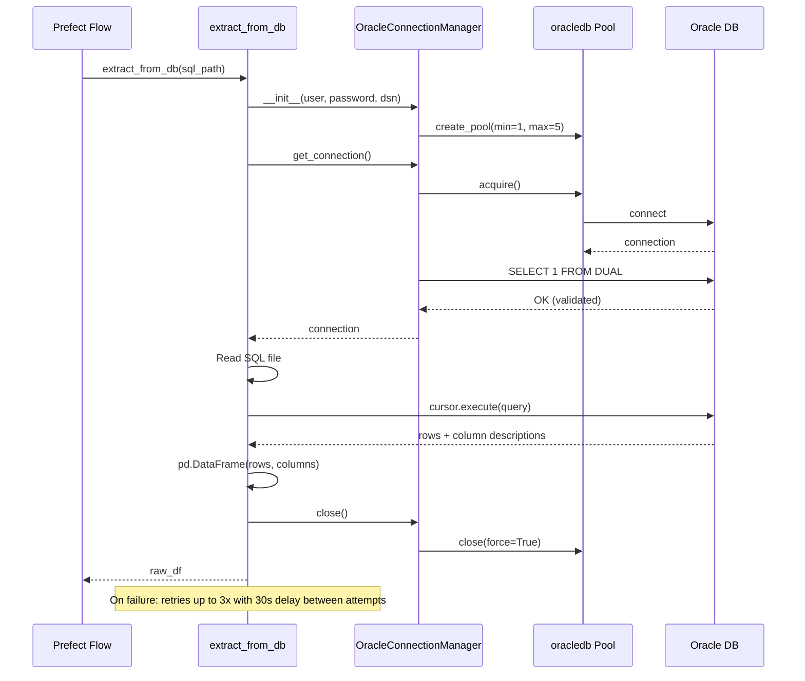

---

## 4. OracleConnectionManager Internals

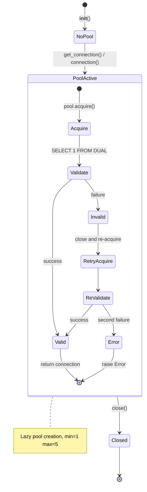

---

## 5. Feature Engineering Pipeline — Detailed

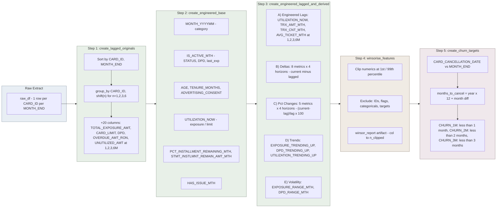

---

## 6. Data Validation Flow

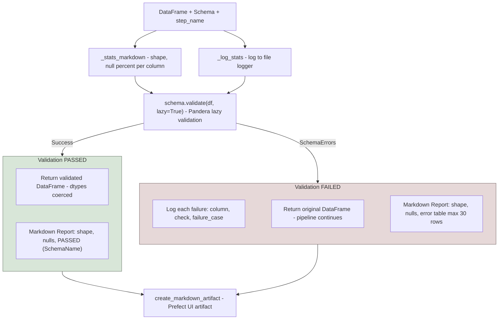

---

## 7. Schema Progression (Column Accumulation)

```mermaid
graph LR
    subgraph RAW["RawExtractSchema"]
        R1["Identifiers: CARD_ID, MONTH_END"]
        R2["Card Snapshot: 30+ cols - CARD_LIMIT, DPD, STATUS..."]
        R3["Customer: 8 cols - CNTRY, EDUCATION, BIRTH_DT..."]
        R4["Statement: 12 cols - FEE_AMOUNT, TRX_AMT_RON..."]
        R5["Profit: 7 cols - TOTAL_PROFIT, FEE..."]
        R6["Transaction: 6 cols - TRX_CNT_MTH, AVG_TICKET..."]
        R7["TLMK: NUMBER_OF_ISSUES"]
        R8["DF checks: no duplicate rows, UNUTILIZED <= LIMIT x 1.05, DPD monotonicity"]
    end

    subgraph LAG["LaggedOriginalsSchema"]
        L1["= RawExtract +"]
        L2["20 lag columns - 5 metrics x 4 horizons"]
    end

    subgraph ENG["EngineeredBaseSchema"]
        E1["= LaggedOriginals +"]
        E2["9 engineered base cols - MONTH_YYYYMM, IS_ACTIVE_MTH, AGE, UTILIZATION_NOW..."]
    end

    subgraph FIN["FinalFeaturesSchema"]
        F1["= EngineeredBase +"]
        F2["16 eng. lags, 32 deltas, 20 pct changes, 3 trends, 2 volatility"]
    end

    subgraph TAR["FeaturesTargetSchema"]
        T1["= FinalFeatures +"]
        T2["CHURN_1M, CHURN_2M, CHURN_3M"]
    end

    RAW ==>|"+20 cols"| LAG ==>|"+9 cols"| ENG ==>|"+73 cols"| FIN ==>|"+3 cols"| TAR

    style RAW fill:#e8eef4,stroke:#7a8a9a
    style LAG fill:#e8f0e8,stroke:#7a8a7a
    style ENG fill:#e8f0e8,stroke:#7a8a7a
    style FIN fill:#f0ebe4,stroke:#8a7a6a
    style TAR fill:#f0e8ec,stroke:#8a7a7a
```

---

## 8. Winsorisation Process

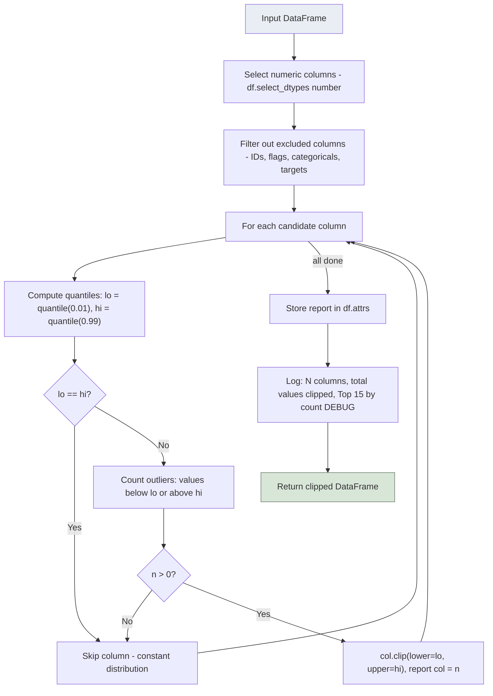

---

## 9. Churn Target Creation Logic

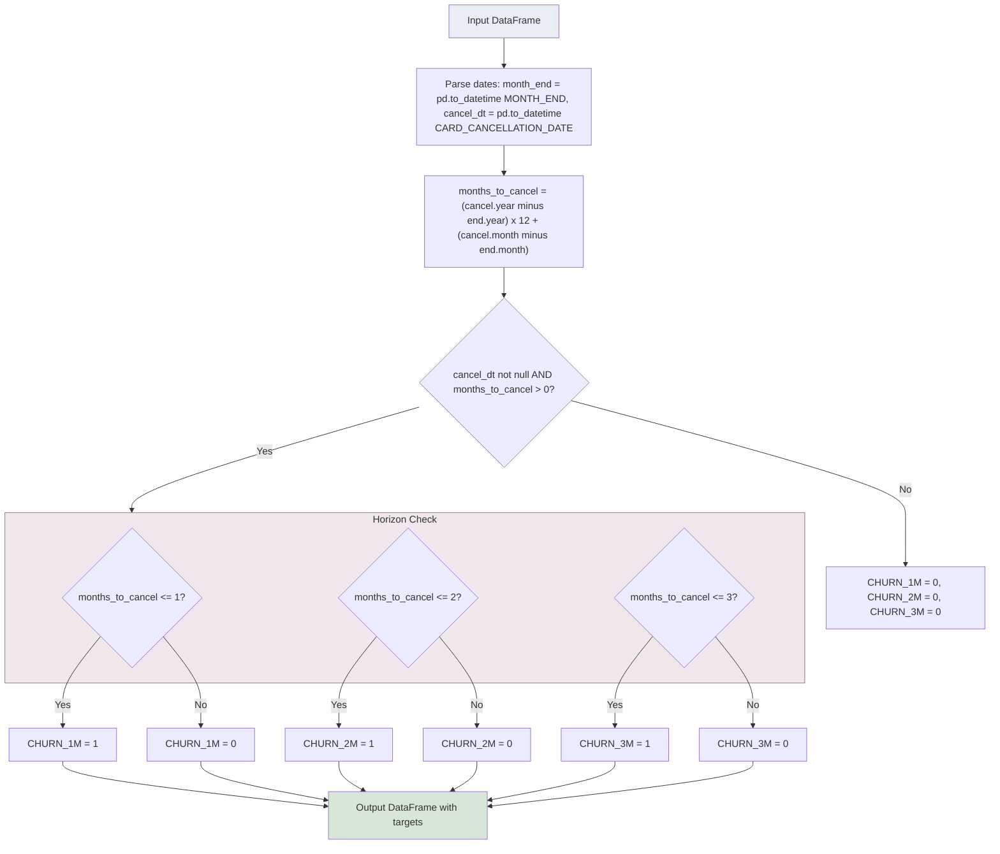

---

## 10. Data I/O and Persistence Flow

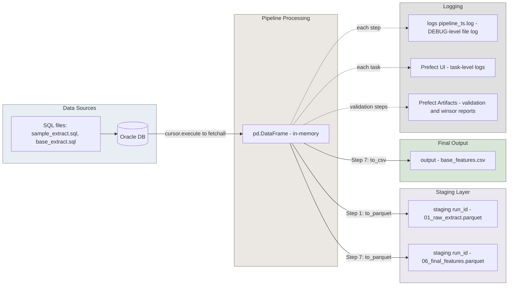

---

## 11. Prefect Task Dependency Graph

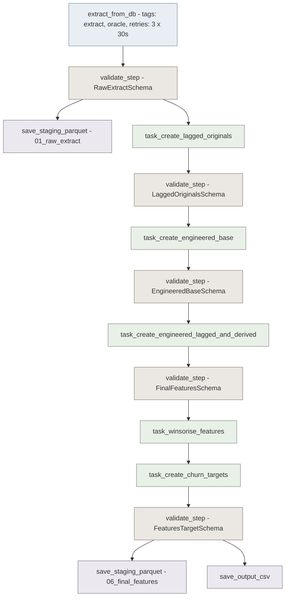

---

## 12. Collective End-to-End Diagram

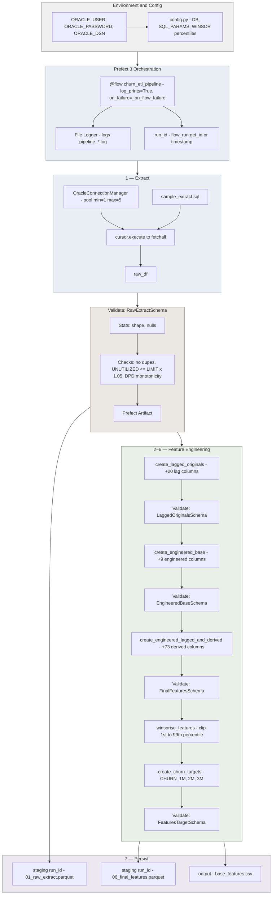

---

## 13. Error Handling and Resilience

```mermaid
flowchart TD
    subgraph Retry["DB Extract Retry Strategy"]
        A1["extract_from_db Attempt 1"] -->|fail| W1["Wait 30s"]
        W1 --> A2["Attempt 2"] -->|fail| W2["Wait 30s"]
        W2 --> A3["Attempt 3"] -->|fail| FAIL_EXTRACT["Task FAILED"]
        A1 -->|success| OK["Continue pipeline"]
        A2 -->|success| OK
        A3 -->|success| OK
    end

    subgraph Validation["Validation Error Handling"]
        VIN["validate(df, schema)"]
        VIN -->|SchemaErrors| WARN["Log warnings, Return original df, pipeline continues"]
        VIN -->|Success| PASS["Return validated df, dtypes coerced"]
    end

    subgraph FlowFail["Flow-Level Failure"]
        FFAIL["Any unhandled exception"]
        FFAIL --> HOOK["_on_flow_failure - print error to console"]
        HOOK --> FUTURE["Extend: Slack or email - placeholder"]
    end

    subgraph ConnPool["Connection Pool Resilience"]
        ACQ["pool.acquire()"]
        ACQ --> VAL{"validate_connection - SELECT 1 FROM DUAL"}
        VAL -->|OK| USE["Use connection"]
        VAL -->|Fail| RETRY["Close and re-acquire"]
        RETRY --> VAL2{"validate again?"}
        VAL2 -->|OK| USE
        VAL2 -->|Fail| ERR["Raise oracledb.Error"]
    end

    style Retry fill:#f0ebe4,stroke:#8a7a6a
    style Validation fill:#ebe8e4,stroke:#8a7a6a
    style FlowFail fill:#f0e8ec,stroke:#8a7a7a
    style ConnPool fill:#e8eef4,stroke:#7a8a9a
```
